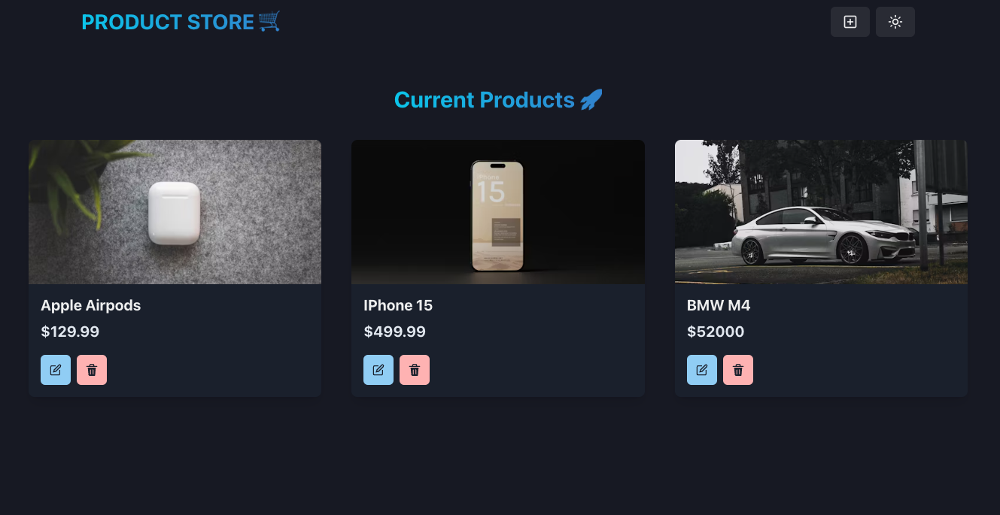

# MERN Marketplace Application
A simple full-stack marketplace application built using the MERN stack (MongoDB, Express.js, React.js, Node.js). This project implements basic CRUD (Create, Read, Update, Delete) operations and serves as a learning tool for understanding and practicing MERN stack development. It includes light-mode and dark-mode themes, as well as functionality to upload, update, and delete products.

# Preview


# Features
User Authentication: Secure login and registration using JWT.
Product Management: Upload, update, and delete products.
Theme Support: Toggle between light-mode and dark-mode.
Responsive Design: Works on all devices.


# Prerequisites
Before you begin, ensure you have met the following requirements:

Node.js and npm installed.
MongoDB instance (local or remote).
Git installed.


# SETUP
Clone the repository and follow these steps:

### Setup .env file

```shell
MONGO_URI=your_mongo_uri
PORT=8000
```

### Run this app locally

```shell
npm run build
```

### Start the app

```shell
npm run start
```


# Contributing
Contributions are welcome! Please follow these steps:

Fork the project.
Create your feature branch (git checkout -b feature/AmazingFeature).
Commit your changes (git commit -m 'Add some AmazingFeature').
Push to the branch (git push origin feature/AmazingFeature).
Open a Pull Request.
